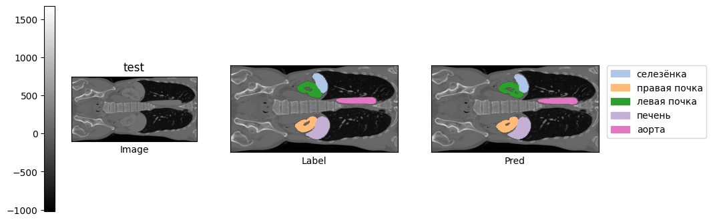

# segment_ac_organs
Computer vision project focusing on abdominal cavity organs segmentation.


## Usage
### Setup

0. Clone segment_ac_organs repository:
    ```
    $: git clone https://github.com/setupishe/segment_ac_organs
    $: cd segment_ac_organs
    ```
### Inference
1. Import necessary packages:
    ```
    from SegmentModule import *
    from OrgansDataset import *
    from OrgansUtils import * 
    ```

2. Initialise model:
    ```
    model = SegmentModule.load_from_checkpoint('path/to/checkpoint.ckpt')
    ```

3. Assuming `images` is np.array in provided dataset format, run:
    ```
    pred = inference_npy(model, image)
    ```
    `pred`  contains labels in default labels format.
### Training
4. To reproduce training, run training script with default training parameters:
    ```
    python3 train_run.py default.json
    ```
    Checkpoint will be saved in `checkpoints` directory.